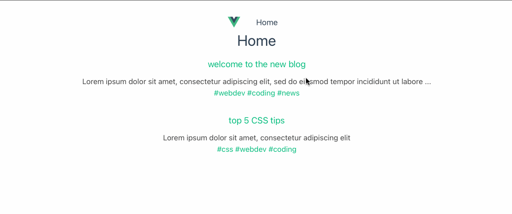

# vue-dojo-blog

This template should help get you started developing with Vue 3 in Vite.

## Customize configuration

See [Vite Configuration Reference](https://vitejs.dev/config/).

## Project Setup

```sh
npm install
```

### Compile and Hot-Reload for Development

```sh
npm run dev
```

### Compile and Minify for Production

```sh
npm run build
```

### Install JSON-Server and watch db.json file

```sh
npm install json-server
npx json-server --watch data/db.json
```

### Vue.js Dojo Blog Screenshot
