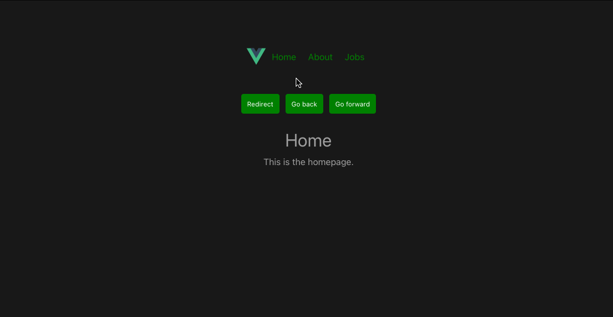

# vue-ninja-jobs

This template should help get you started developing with Vue 3 in Vite.
We create a simple jobs app.

## Customize configuration

See [Vite Configuration Reference](https://vitejs.dev/config/).

## Project Setup

```sh
npm install
```

### Compile and Hot-Reload for Development

```sh
npm run dev
```

### Compile and Minify for Production

```sh
npm run build
```

### Vue.js Ninja Jobs Screenshot
