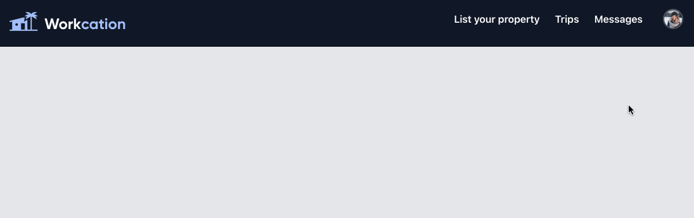

# vue-tailwind-build-dropdown-menu

This template should help get you started developing with Vue 3 in Vite. 
We build a dropdown menu with Tailwind.

## Customize configuration

See [Vite Configuration Reference](https://vitejs.dev/config/).

## Project Setup

```sh
# run outside of project-folder
npm init vue@latest

# run after creating project-folder
cd <project-folder>
npm install
npm install tailwindcss postcss-cli autoprefixer postcss-minify
npx tailwind init
```

### Compile and Hot-Reload for Development (Tailwind)

```sh
npm run tailwind
```

### Compile and Hot-Reload for Development

```sh
npm run dev
```

### Compile and Minify for Production

```sh
npm run build
```

### Run dist production

```sh
npm serve dist
```

### Account Dropdown Preview Image


